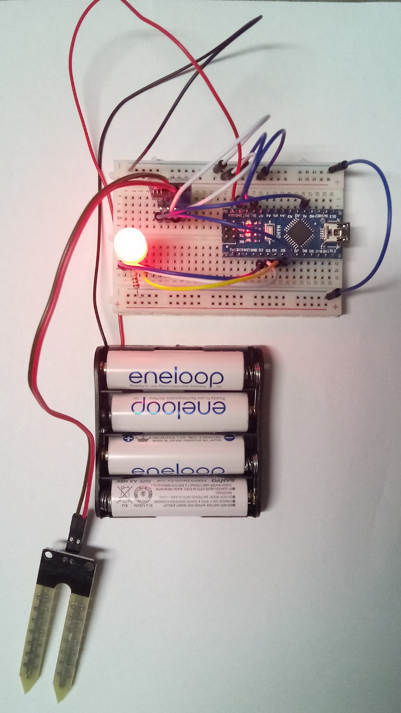
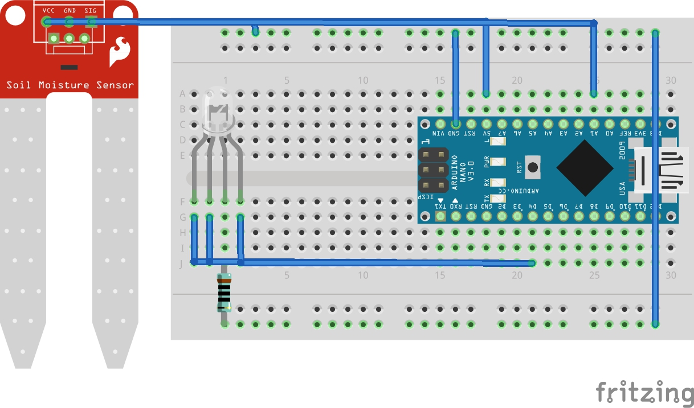

# Water Me

I needed to make sure at least one of my plants gets enough water. So I took a small breadboard and an Arduino Nano clone to quickly hack something together.

Here is a photo:

This is the setup diagram (thanks to Fritzing):

Please bear with the fact that I had to use a different moisture sensor for the diagram. It should work with either the cheap one I used or the more expensive one in the breadboard diagram.

### Parts
* 1 x Arduino Nano (or as in my case one of the Chinese clones)
* 1 x moisture sensor with the strange label "Flying-Fish"
* 1 x 100 Ohm resistor
* 1 rgb LED
* 1 small breadboard
* some wires

